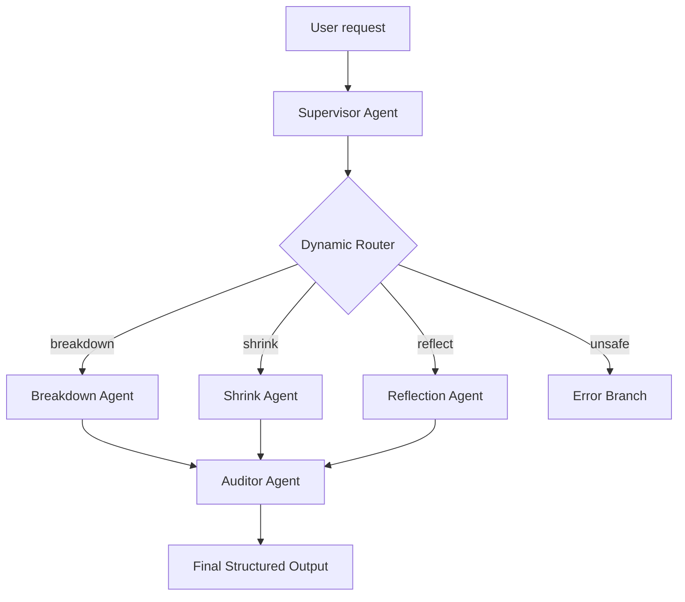

# FirstBeam / Lighthouse Concierge 🗼

FirstBeam is a local-first AI productivity companion that helps people overcome procrastination by turning overwhelming tasks into small, emotionally manageable next steps. It combines a **Google ADK multi-agent backend architecture** with a mobile-first **Serverless Progressive Web App (PWA)** interface focused on starting rather than simply listing work.

Youtube link: https://www.youtube.com/watch?v=PRwPWTr3OFY

---

## 1. Brief Introduction
For a highly visual, styled overview of the project's story, problem statement, and demo flow, **please double-click the `firstbeam-intro.html` file in this folder to open it in your web browser**.

---

## 2. Problem, Solution, Value

### The Problem
Existing productivity tools often help users record tasks, but they do not reduce the psychological friction of beginning those tasks. Even after a task is written down, a user may still procrastinate because the task feels too large, the first step is unclear, and the emotional weight increases avoidance. 

### The Solution: Why Agents?
FirstBeam Focus uses a **Concierge Agent** to invert the traditional to-do list model. Instead of you managing the list, the agent manages you:
- **Dynamic Decomposition ("Break it down")**: You enter an overwhelming task (e.g., "Prepare for my PM interview"). The agent breaks it down into small, actionable steps.
- **Micro-Manager ("Make it smaller")**: If a subtask still feels too intimidating, the agent can recursively shrink it into a 5-minute atomic step to bypass emotional resistance.
- **Psychological Profiling**: The agent considers your MBTI/Personality type to tailor the tone and granularity of the subtasks.
- **Habit Analytics**: As you complete tasks using the built-in focus timer, the system records your estimated vs. actual time. A background agent builds a **Habit Profile**, learning your biases to adjust future task breakdowns.

### The Value
FirstBeam transforms anxiety into immediate, guided action. It provides the cognitive relief of a personal executive assistant while maintaining data privacy.

---

## 3. Architecture & Technical Implementation

The repository contains both a real **Google ADK Backend** and a **Serverless PWA Frontend**.

### Backend: Google ADK Multi-Agent Architecture
The backend (located in `app/agent.py` and wrapped with FastAPI in `app/fast_api_app.py`) defines a complete multi-agent workflow:
- **Supervisor Agent**: Detects user intent, sanitizes input, checks safety, and extracts MBTI preferences.
- **Dynamic Router**: Routes the request to the correct specialist branch based on intent.
- **Specialist Agents**:
  - *Breakdown Agent*: Creates initial micro-subtasks.
  - *Shrink Agent*: Recursively reduces tasks into low-friction steps.
  - *Reflection Agent*: Generates warm reflection messages based on effort.
- **Auditor Agent**: Softens harsh/coercive phrasing into a supportive tone while preserving task structure.



### Frontend: Mobile-First Serverless PWA
The frontend (`index.html`, `app.v54.js`) is designed for maximum emotional warmth and privacy. 
- **Local-First Persistence**: Your tasks, habit profiles, and optional Gemini API keys are stored **100% locally** in the browser's `localStorage`.
- **Hybrid API Call Pattern**: If the user provides a Gemini API key in the Profile view, the frontend can bypass the backend and directly call the Gemini API from the browser for task breakdown, shrinking, and habit analysis. If no key is set, the app falls back to local mocks.
- **Data Sovereignty (Import/Export)**: Users can download a local JSON backup of their records and restore them without relying on a centralized database.

### Key Evaluation Concepts Demonstrated
1. **Agent / Multi-agent system (ADK)**: Strongly present via the ADK workflow with supervisor, specialists, and auditor.
2. **Security Features (Local-First)**: Prompt safety intent, tone auditor, BYO-key model, and zero backend database (local `localStorage` persistence).
3. **Deployability**: Configured with a `Makefile`, FastAPI wrapper, `vercel.json` static routing, and Service Worker offline caching.
4. **Antigravity**: The entire application was co-developed using the Antigravity agent platform.

---

## 4. Setup & Deployment Instructions

**Live Demo: [https://firstbeam.vercel.app](https://firstbeam.vercel.app)**

### Running Locally (Frontend Only - PWA Mode)
1. Clone the repository.
2. Open `index.html` directly in your browser, or serve it statically:
   ```bash
   python3 -m http.server 8000
   ```
3. Open `http://localhost:8000`.
4. Click **Profile** (bottom right), enter your Gemini API Key, and try creating a beacon!

### Running Locally (With ADK FastAPI Backend)
1. Install Python dependencies: `pip install -r requirements.txt`
2. Run the FastAPI server: `make run`
3. The server will host the ADK app and serve the frontend statically.

### Vercel Deployment
- The app is production-ready for Vercel. 
- Install Vercel CLI (`npm i -g vercel`), and run `vercel --prod` to deploy globally.


