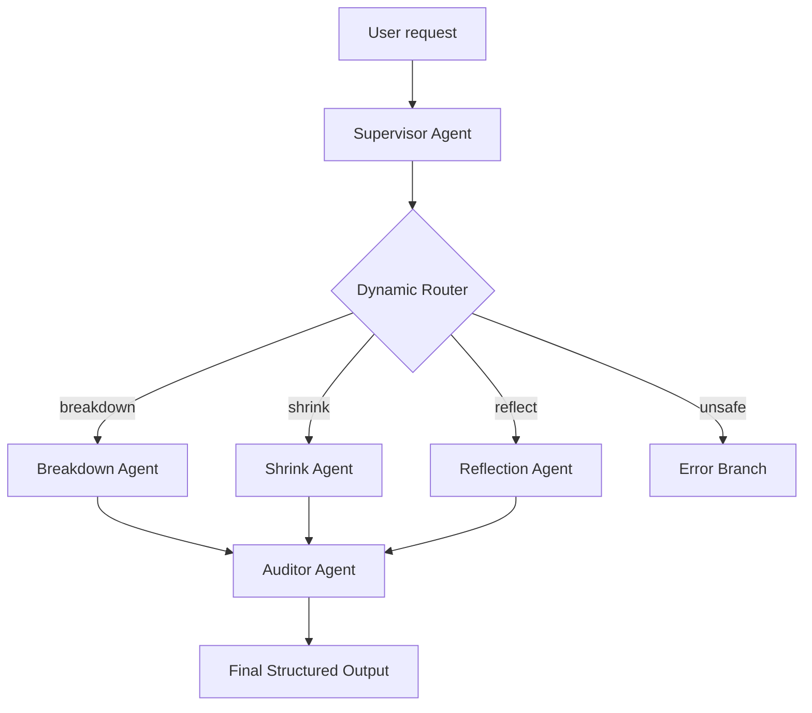

# FirstBeam 🗼

> **Live Demo:** [https://firstbeam.vercel.app](https://firstbeam.vercel.app)

FirstBeam is a mobile-first productivity and emotional support web application designed for individuals who know what they need to do but struggle to begin due to tasks feeling too large, too vague, or emotionally heavy. The project frames **tasks** as **"beacons"** and uses an agent-driven support model to help users move from overwhelm to action through smaller, more approachable steps.

> [!NOTE]
> **The Metaphor of FirstBeam:**
> When facing a massive, stressful task, users often feel lost in the dark. Instead of adding to the overwhelm with a rigid to-do list, FirstBeam frames the ultimate goal as a **"Beacon"**—a distant lighthouse providing steady, clear direction. To help users actually get started, the app provides the **"First Beam"** of light: **one single, emotionally manageable micro-step** that cuts through task paralysis and builds the momentum needed to keep moving forward.

---

## ─── 🔴 The Problem ───

There are already many to-do list apps and focus tools, but they often solve the wrong part of procrastination. They help people record *what* needs to be done, but **recording a task does not always make it easier to start.**

The problem FirstBeam solves is the exact moment of execution friction:
* ⚠️ **Task Paralysis**: The task feels too big, too vague, or too emotionally heavy. 
* ⚠️ **The To-Do List Trap**: A traditional to-do list becomes another place where the task sits untouched, increasing anxiety.
* ⚠️ **Pressure-Driven Execution**: The user keeps delaying until the deadline becomes urgent, then stays up late to finish under immense stress.

> [!IMPORTANT]
> **Core Philosophy:**
> Procrastination is often **not a lack of awareness**; it is a **lack of a small, believable first step**. When the beginning feels emotionally costly, users avoid it. FirstBeam targets this exact starting friction.
>
> This aligns perfectly with the **Concierge Agents** track—addressing an individual, everyday challenge by helping people manage their personal work in a way that is safe, supportive, and practical.

---

## ─── 🟢 The Solution ───

FirstBeam turns an overwhelming task into a **"beacon"**: a guided path made of smaller actions. 

### The Core User Flow
* 📥 **1. Input** — The user enters a stressful or hard-to-start task.
* 🌿 **2. Decompose** — FirstBeam creates a small, friendly task breakdown.
* 🔍 **3. Shrink (The Core Loop)** — If the next step still feels too big, the user can click **"Make it smaller"** to break it down further.
* ⏱️ **4. Focus** — The user enters focus mode for a single, low-friction micro-step.
* 📊 **5. Record** — The app records estimated versus actual time spent.
* 🧠 **6. Habit Profile** — The background agent analyzes timing behavior to build a custom habit profile.
* 💾 **7. Local Backup** — Users can export or import records as a local JSON backup.

> [!TIP]
> **Repeated Decomposition at the Moment of Resistance:**
> Unlike normal planners that generate a static task list once, FirstBeam is designed to assist when the initial list is *still* too intimidating. It allows users to recursively **shrink the current step** until the barrier to entry disappears.
>
> **Progress Without Shame:**
> Unfinished or overdue work is not treated as a failure. Archived tasks can be **"relit"** with a new deadline, reframing the restart as turning a signal back on.

---

## ─── ✨ Innovation and Value ───

FirstBeam bridges the gap between **productivity support** and **emotional friction reduction**.

| Dimension | Standard Productivity Tools | FirstBeam Innovation |
| :--- | :--- | :--- |
| **Focus Area** | Organizing and logging tasks | **Starting** and reducing initial friction |
| **Step Sizing** | Static subtasks created once | **"Make it smaller"** dynamic recursively-shrunk steps |
| **Personalization** | Generic settings and reminders | **Habit Analysis** based on estimated vs. actual timing |
| **Data Privacy** | Centralized databases (High leak risk) | **100% Local-First** storage with easy migration |

### Personalized Habit Profiling
Procrastination patterns are highly personal:
* Some users consistently **underestimate** how long coding tasks take.
* Others **avoid** tasks that are ambiguous.
* Others need **very concrete** physical first steps (e.g., "Open document").

FirstBeam stores a local **Habit Profile** and feeds this context back into future task breakdowns and shrink requests, adjusting time estimates dynamically.

---

## ─── 🏗️ Architecture ───

The project features a decoupled, hybrid architecture consisting of a mobile-first frontend and a Google ADK backend workflow.

### 📱 Frontend Layer

The frontend (`index.html`, `index.v53.css`, `app.v54.js`) is a mobile-first single-page app (SPA) with the following views:
* **Home / Tonight's Beacon** — The primary starting focal point.
* **Active Beacon List** — Overview of currently active tasks.
* **Archive / Relight** — Reactivating past or expired tasks.
* **Tower Task Detail** — The nested subtask tree.
* **Focus Mode** — Dedicated execution timer.
* **Profile** — Habit analysis and configuration.

> [!NOTE]
> **Data Sovereignty:**
> All persistent state (`firstbeam_state`, `firstbeam_habit_profile`, `firstbeam_api_key`, `firstbeam_model`) is stored **locally** in the browser's `localStorage`. Users can export a `firstbeam_backup.json` file to backup or migrate data, meaning no server-side user database is required.

* **API Call Pattern**: When a user inputs their own Gemini API key, the frontend directly triggers client-side Gemini calls (`intake_task`, `shrink_task`, `analyze_habits`). If no key is provided, it gracefully falls back to local mock behaviors.

---

### ⚙️ Backend Layer (Google ADK)

The backend is implemented with **Google ADK** in `app/agent.py` and wrapped with **FastAPI** in `app/fast_api_app.py`. It runs the following multi-agent workflow:
1. 🛡️ **`supervisor_agent`** — Detects user intent, extracts MBTI tone context, sanitizes inputs, and flags prompt injections.
2. 🔀 **`dynamic_router`** — Branches the request to the correct specialist.
3. 🌿 **`breakdown_agent`** — Decomposes tasks into micro-subtasks.
4. 🔍 **`shrink_agent`** — Recursively shrinks tasks into low-friction steps.
5. 💬 **`reflection_agent`** — Supports post-task user reflection.
6. 🔬 **`auditor_agent`** — Rewrites harsh/shaming language into warm, supportive wording.
7. 📦 **`finalize_output`** — Packages the output into structured JSON.

* **Prototype Status**: The ADK backend workflow is fully defined and wrapped in FastAPI (exposing `/run` and `/run_sse`). For prototype convenience, the active live demo routes API calls directly from the browser, while the backend serves as the blueprint for the target agent architecture.

---

## ─── 🔒 Security and Privacy ───

### 1. Personal Data Management
Persistent task records are stored **locally** on the user's own device through `localStorage`. There is no cloud-hosted database. If a user inputs a Gemini API key, the key is saved locally in the browser to facilitate the Bring-Your-Own-Key (BYOK) model.

### 2. Agent Loop Supervision
To guarantee safety and alignment, the workflow employs **Agent Loop Supervision**:
* The **Supervisor Agent** sanitizes inputs, redacts PII, and detects prompt-injection attacks.
* The **Auditor Agent** acts as an emotional safety net, rewriting any shame-based or coercive phrasing into validating, encouraging language.

---

## ─── 📦 Deployability ───

Built as a **Progressive Web App (PWA)**, FirstBeam offers:
* 🖥️📱 **Responsive Adaptability**: The UI automatically detects and adapts to both desktop and mobile screens to elevate the user experience.
* 📲 **Standalone Installation**: Can be installed directly to desktop or mobile home screens.
* ⚡ **FastAPI / Vercel Serving**: Ready to be served locally via FastAPI or deployed instantly to Vercel.

---

## ─── 🎯 Conclusion ───

FirstBeam solves a focused human problem: the gap between knowing a task exists and being able to start it. By combining a supportive mobile UX, local-first data handling, user-controlled Gemini integration, and a Google ADK multi-agent backend architecture, FirstBeam helps users move **from overwhelm to action**, one small step at a time.
